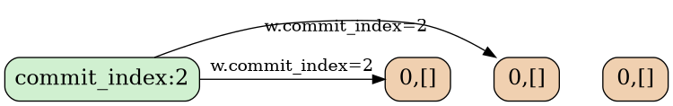
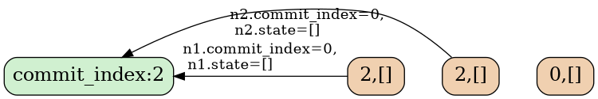
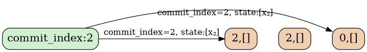
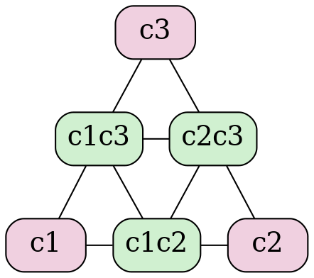

Title: "Unifying Paxos and Raft into a Single Protocol: Abstract-Paxos"
Authors:
    - xp
Categories:
    - Algorithm
Tags:
    - Distributed
    - Paxos
    - Raft
    - Consensus
    - Distributed Systems

References:
    - x: y

Article:
    Image: /post-res/abstract-paxos/abstract-paxos-banner-small.png

MathJax: true
Table of Contents: true
TOC Label: Table of Contents
TOC Sticky: true
Excerpt: "From ancient times to the present, there have been two supreme techniques in the martial arts world, Paxos and Raft. After thirty days, I have spent a full thirty days integrating these two techniques into one complete move. Watch closely: Abstract-Paxos."

---

# Preface (Formalities, but they add a sense of ceremony)

Previously, I wrote an article titled [Intuitive Explanation of Paxos][post-paxos], which described the working principles of Paxos in simple language. Friends who read it said it was the most understandable introduction to Paxos they had ever seen. They also asked me if I would write one about Raft. However, since there are already many excellent articles on Raft, I felt there was nothing more to add and kept putting it off.

Later, I remembered that during interviews for distributed system positions, I would often be asked about the differences between Raft and Paxos. Although it might annoy the interviewer, I would say: There is no difference. Today, I will introduce a distributed consensus algorithm that unifies Paxos and Raft, called [Abstract-Paxos][repo-abstract-paxos]. This algorithm explains the derivation process of various distributed consensus algorithms from 0 to 1. This fills the gap left by Raft and, from a more abstract perspective, makes it easy to see the design flaws and several optimization methods in Raft.

To clearly demonstrate the problems that distributed consensus protocols aim to solve, we will start from scratch, specifically from two fundamental requirements: **information certainty** and **distribution**. We will derive the unified form of all strong distributed consensus protocols and then specialize it into Raft or Paxos.

The entire derivation process follows this sequence, starting from assumptions and ultimately reaching the protocol:

```graphviz
digraph x
{
    size="5,5";

    dpi=500;

    node[shape=box, style="filled,rounded", fillcolor="#d0f0d0", fontsize=18];

    subgraph cluster_assumption {
        label = "assumption";
        {
            rank=same;
            shannon[label="Shannon's Information Definition"];
            distributed[label="Distributed"];
        }

    }

    # datatyps
    {

        node[fillcolor="#f0d0e0"];
        writer_struct[label="Writer: \{\l  commit_index:u64,\l  quorum: Quorum\l\}\l"]
        st_v1[label="State(draft): Vec\<Cmd\>"]
        st_v2[label="State: Vec\<\{\l  commit_index: u64,\l  cmd: Cmd\l\}\>\l"]
    }

    subgraph cluster_protocol {
        label = "protocol";
        {
           # rank=same;
            rankdir=TD;
            node[fillcolor="#f0d0b0"];

            p0[label="p1.1: Prevent smaller State from committing"];
            p1[label="p1.2: Read committed State"];
            p2[label="p2: Write State to a quorum"];

            p0 -> p1 -> p2;

        }

    }


    writer[fillcolor="#ffffd0"];
    reader[fillcolor="#ffffd0"];
    st[label="State", fillcolor="#ffffd0"];

}
```



# Article Structure

- Problem Statement
- Protocol Derivation
    - Definition of Commit
    - Definition of System State (State)
- Protocol Description
- Engineering Practice
- Membership Changes
- Describing Paxos with Abstract-Paxos
- Describing Raft with Abstract-Paxos
    ```rust
    block();
    ```

# Problem

Starting from the problem we aim to solve: implementing a **distributed**, strongly consistent **storage** system. A storage system is designed to store information, so we begin by defining **information** and **distributed storage**:

## Shannon's Definition of Information

Shannon's information theory defines:
**Information is something that eliminates random uncertainty**.

Specifically, a `read` operation on certain information should yield the same, unique, and definite content each time. This definition will serve as the foundational axiom for our design of the consistency protocol throughout this article.

## Distributed Storage

- A **storage system** can be viewed as an entity that can change its state (State) based on external commands (Cmd). For example, in a key-value storage, commands like `set x=1` or `set x=y+1` can be considered as Cmds.

- **Distributed** implies that the **storage system** consists of multiple nodes (a node can be thought of as a process), with operations performed by multiple concurrent writers (writer) and readers (reader).

- A reliable **distributed** system also means it must **allow for failures**: it must be able to tolerate partial node failures and still function correctly.

  Therefore, it must have **redundancy**, i.e., each node stores a replica of the State. The purpose of the distributed consistency protocol is to ensure that external observers (reader) can provide State information that meets **Shannon's definition of information**.

The system must be designed to function even when writers or readers can only access **some** nodes. In the context of distributed systems, this **some** is typically defined as a **quorum**.

# Quorum

A quorum is defined as a collection of nodes, for example, a `HashSet<NodeId>`.

In this system, the **distributed** nature requires that a writer only needs to contact a quorum to complete the writing of a **message**, thereby achieving **quorum-write**. Similarly, a reader only needs to contact a quorum to reliably read a **message**, achieving **quorum-read**.

Since the information written by a writer must be readable by a reader, any two quorums must have an intersection:

$$
q_i \cap q_j \ne \emptyset
$$

> Most often, a quorum refers to a **majority**, which is a collection of more than half of the nodes.
> For example, `{a,b}, {b,c}, {c,a}` are three quorums of the set `{a,b,c}`.

If any reader can read a piece of data by accessing a quorum, then that data meets the **Shannon information definition**, and we consider that data to be **committed**.

# Commit

According to the **Shannon information definition**,
**if the data written can definitely be read by some method, it is considered committed**.

If a piece of data can sometimes be read and sometimes not, it is not a **message**.

## Example of Uncertain Read

### Example 1: Reading Uncertain Results

Consider the following example with three nodes `N1, N2, N3`:

- `N1` stores `[x,y]`,
- `N3` stores `[z]`.
When using **quorum-read** to read, sometimes you get `[x,y]` (accessing `N1, N2`), and sometimes you get `[z]` (accessing `N2, N3`).

Therefore, `[x,y]` and `[z]` are both **not messages** in this system and are not in a committed state.

```
N1: [x,y]  | [x,y]
N2: []     |           |
N3: [z]                | [z]

--- Example 1 ---
```

### Example 2: Always Readable Results

In the following **Example 2**, a **quorum-read** will always see `[z]`, no matter which two nodes are accessed.

So `[z]` has the potential to become a **message** in this system.

At this point, it is not yet certain that `[z]` is a message, because if a reader accesses `N1, N2`, it involves choosing between `[x,y]` and `[z]` as the current state of the system, meaning the read result is not yet guaranteed to be **unique**. This will be discussed further.

```
N1: [x,y]  | [x,y] or [z]
N2: [z]    |              |
N3: [z]                   | [z]

--- Example 2 ---
```

Thus, we have derived the conditions for a committed state in a multi-replica storage system:

- **commit-write quorum**: To ensure that any reader can read the data.
- **commit-unique**: To ensure that multiple readers return the same result.
- **commit-immutable**: To ensure that multiple reads return the same result.

We will first explain these conditions, then discuss how to design a commit protocol to meet these conditions, thereby achieving consistency.

## commit-write quorum

A piece of data must be visible to readers: i.e., the data has been written to a **quorum**: **commit-write quorum**.

## commit-unique

Here, **unique** means, on top of being **visible**, adding a requirement for **uniquely determined** results:

In the example above, **Example 2**, if a reader performs a read operation and accesses nodes `N1` and `N2`, it will receive two different copies of the state: `[x, y]` and `[z]`. Both of these state copies are **visible**, but as a storage system, any reader must choose the same state as the current system state (otherwise, it would violate the principle of eliminating uncertainty as defined by **Shannon's Information Theory**).

Therefore, we require that the reader must be able to uniquely determine a state from all **visible** copies to serve as the result of the read operation.

## Immutable After Commit

**Shannon's Information Theory** dictates that a state that has been committed must always be readable: this means that the committed state cannot be overwritten or modified, only **appended** to.

> The idea that a state cannot be modified may seem counterintuitive, as typical storage systems allow for changes, such as updating `x=1` to `x=2`. It appears that modifications are permitted.
>
> This can be understood as follows:
>
> A state that transitions from `x=1` to `x=2` (`[x=1, x=2]`) is different from a state that directly reaches `x=2` (`[x=2]`). The difference lies in the possibility that at some point, `x=1` can be read from the first state, which is not possible from the second state.

A common definition of state is a **list of commands that only allows appending**: `Vec<Cmd>`.

This is essentially a log of change operations (commands), also known as a write-ahead log (WAL). The system's state is uniquely defined by the WAL. In a typical WAL + State Machine system (such as [leveldb][repo-leveldb]), the WAL determines the system state, like these three logs: `[set x=1, set x=2, set y=3]`. The State Machine, which people commonly refer to, is merely responsible for presenting the entire system state in a form convenient for the application, typically in the form of a HashMap: `{x=2, y=3}`.

Therefore, in this article, the WAL is the true state, and the notion of being immutable and only appendable refers to the WAL. We will not discuss the implementation of the State Machine in this article.

If the state of the storage system is viewed as a set, **it must be a set that only increases**:

# State

The purpose of this article is merely to unify paxos and raft, and it does not need to be overly complex. It is sufficient to define the state as an append-only operation log:

```rust
struct State {
    log: Vec<Cmd>,
}
```

Each entry in the log is a command (Cmd) that changes the system state.

> This is a preliminary design of the state. To implement this consistency protocol, we will later add more information to the state to meet our requirements.

According to the **commit-write quorum** requirement, the final state will be written to a quorum to complete the commit. We will temporarily call this process **phase-2**. Before executing this step, we need to design a protocol that ensures the commit process adheres to the constraints of:

- **commit-uniqueness**,
- **immutability after commit**.

First, let's look at how to ensure the uniqueness of data after commit. This involves how the reader selects one state from the different state copies returned by multiple nodes in the quorum as the final result of the read operation:

# Reader: Identifying State Copies That Have Not Been Committed

According to **Shannon's Information Theory**, a state that has been committed must be guaranteed to be readable. However, multiple writers might concurrently write **different** states to multiple nodes without being aware of each other.

The text discusses the concept of state management in a distributed system, particularly focusing on the need for a total order among states to ensure consistency and prevent information loss. Here's a naturalistic translation of the provided markdown:

---

When different states are written, for instance, two states s₁ and s₂, if neither `s₁ ⊆ s₂` nor `s₂ ⊆ s₁` is satisfied, then only one of them can be committed. Otherwise, information loss occurs.

When a reader encounters two different states on different nodes, the reader must be able to rule out one state that definitely has not been committed, as described in **Example 2**.

This implies that the **commit-uniqueness** requirement states that among two states that are not in a subset relationship, at most one can be in a commit state. It also requires that the two states can be compared to exclude one that is definitely not committed, indicating that there exists a **total order** among states:

- The **larger state** is potentially commit-able,
- The **smaller state** is definitely not commit-able.

### Total Order of States

The **total order** of states represents the validity of commits. However, so far, a state itself is an operation log, which is a list, and lists only have a **[partial order][wiki-partial-order]**, which is the subset relationship. Two lists that are not subsets of each other cannot determine a size relationship.

For example, if logs `[x, y, z]` and `[x, y, w]` are read on two different nodes, it is impossible to determine which one is potentially commit-able and which one is definitely not commit-able:

```
x --> y --> z
       `--> w
```

Therefore, states must contain additional information to form a total order.

This total order must also be controllable:
For any given state, it should be possible to make it larger than any known state. Otherwise, when a writer attempts to commit new data into the system, it cannot produce a sufficiently large state for the reader to choose, preventing the writer from completing the commit.

#### Adding Sorting Information to States

For instance, in **Example 3**, if each node adds a sequence number to its state, then regardless of which two nodes a reader contacts, it can determine to choose the state with the higher sequence number `[y]` as the reading result, thereby considering `[y]` as a committed state.

```
N1: [x,y]₂
N2: [y]₅
N3: [y]₅

--- Example 3 ---
```

The principle of **no modification after commit** requires that all modifications in the system must be based on committed states. Therefore, when a new data is committed in the system, it might be appended to `[y]₅`:

```
N1: [x,y]₂
N2: [[y]₅,z,w]₇
N3: [[y]₅,z,w]₇

--- Example 4 ---
```

To implement this logic, a simple approach is to let the last log node determine the size relationship between two states.

Thus, we can add a `commit_index` attribute (using an integer for simplicity) to each log node in the state to establish a total order:

```rust
struct State {
    log: Vec<{
        commit_index: u64,
        cmd: Cmd
    }>,
}
```

In subsequent examples, we will write `commit_index` in the subscript form for each log, such as:

```rust
vec![
    {commit_index: 3, cmd: x},
    {commit_index: 5, cmd: y},
]
```

Which will be represented as:

```
[x₃, y₅]
```

We also define a method to obtain the `commit_index` for comparison purposes:

```rust
impl State {
    pub fn commit_index(&self) -> u64 {
        self.log.last().commit_index
    }
}
```

The value of `commit_index` is determined by the writer when it writes the state. This means the writer decides the size of the state it writes.

---

This translation maintains the technical details and the structure of the original markdown, ensuring that the links and images are preserved.

If two states are not in a subset relationship, then their size is determined by the `commit_index`. A writer can ensure that a state is selected by a reader by performing a quorum-write with a sufficiently large state, thereby completing the commit.

This also implies:

- The `commit_index` of two states that are not in a subset relationship cannot be the same. Otherwise, a total order cannot be established between the states. This means that any two writers must not produce the same `commit_index`.

- States produced by the same writer are necessarily in a subset relationship and do not require the `commit_index` to determine their size:

  For two states in a subset relationship: sₐ ⊆ sᵦ, it is obvious for the reader to choose the larger sᵦ, without needing the `commit_index` to determine the size of the state. Therefore, a writer can produce states with the same `commit_index` for multiple logs and use the length of the log to determine the size relationship.

Thus, we have defined the size relationship of states:

## Definition of Total Order for States

The order relationship between two states is determined by the `commit_index` and the length of the log, i.e., by comparing the `(s.commit_index(), s.log.len())` of the two states.

> As mentioned above, `commit_index` is a value with a partial order relationship, and different types of `commit_index` concretize [abstract-paxos][repo-abstract-paxos] into a specific protocol or family of protocols, such as:
>
> - If `commit_index` is an integer, it is akin to the rnd in paxos.
> - In raft, the concept corresponding to `commit_index` is `[term, Option<NodeId>]`, which is a value with a partial order relationship and is also what causes frequent election conflicts in raft.
>
> > How [abstract-paxos][repo-abstract-paxos] maps to paxos or raft is discussed at the end of this article.
>
> On the other hand, from the perspective of a writer:
>
> - If a writer can generate a `commit_index` that is greater than any known `commit_index`, then [abstract-paxos][repo-abstract-paxos] is a system with a **livelock**: it will never block, but may never successfully commit. This is the case with paxos or raft.
> - If a writer cannot generate an arbitrarily large `commit_index`, then it is a system with a **deadlock**, such as [2pc][wiki-2pc].
>
> It is also possible to construct a `commit_index` that makes [abstract-paxos][repo-abstract-paxos] both livelocked and deadlocked, which could be considered a protocol that combines paxos and 2pc.

With the total order relationship between states established,
then ensure that the writer in **phase-2** writes the largest state to the quorum,
so that the reader can always choose this state when reading, meeting the requirements of Shannon's definition of information certainty, i.e., the requirement for **commit-uniqueness**, and thus completing the commit:

# Protocol Design

Now, let's design the entire protocol. First, there is a writer `w`,
`w`'s final commit operation is to write the state to a quorum in **phase-2**.
The writer's data structure is defined as the quorum it has chosen and the `commit_index` it has decided to use:

```rust
struct Writer {
    quorum: BTreeSet<NodeId>,
    commit_index: u64,
}
```

Because when a reader reads, it only selects the largest state it sees and ignores smaller ones.
Therefore, if a larger state has already been committed, the system must no longer allow the commit of a smaller state,
otherwise, it would cause the smaller state to believe it has completed the commit, but it will never be read, resulting in information loss.

[repo-abstract-paxos]: https://example.com/abstract-paxos
[wiki-2pc]: https://en.wikipedia.org/wiki/Two-phase_commit_protocol

Here's the translation of the given markdown into naturalistic English, preserving links and images:

> For instance, in the scenario described in **Example 5** below, if no defensive measures are taken before writing to the State, then the commit cannot be completed:
> Suppose there are two writers `w₁` and `w₂` simultaneously writing their own State to their respective quorums:
>
> - At time t1, `w₁` writes `[y₅]` to `N2, N3`,
> - At time t2, `w₂` writes `[x₁,y₇]` to `N1`.
>
> Then, when a reader contacts `N1, N2` for a read operation,
> it will consider `[x₁,y₇]` as committed, while the data truly committed by `w₁` is lost, violating the **Shannon information definition**.
>
> ```
> N1:         [x₁,y₇]
> N2: [y₅]
> N3: [y₅]
> ----+-------+-----------------------------------------> time
>     t1      t2
>
> --- Example 5 ---
> ```

Therefore: **A writer must prevent smaller States from being committed before committing a State**.
This is what **phase-1** is meant to do first:

## Phase-1.1 Preventing Smaller States from Being Committed

Suppose writer `w₁` is to write State `s₁`,
before `w₁` writes `s₁` to a quorum, the entire system must prevent any State smaller than `s₁` from being committed.

Since different writers will not generate the same `commit_index`.
Thus, the system only needs to prevent States with smaller `commit_index` from being committed:

To achieve this, at this step,
first notify each node in `w₁.quorum`: reject all **phase-2** requests with `commit_index` smaller than `w₁.commit_index`.

Hence, we can basically determine the data structure of a node, which needs to store the State actually written in **phase-2**,
as well as the `commit_index` to be rejected in **phase-1.1**:

```rust
struct Node {
    commit_index: u64,
    state: State,
}
```

> In subsequent examples, we will use a numeric prefix to denote the `commit_index` in a node, for instance:
>
> ```rust
> Node{
>     commit_index: 7,
>     state: State{
>         log: vec![
>             {commit_index: 3, cmd: x},
>             {commit_index: 5, cmd: y},
>         ]
>     }
> }
> ```
>
> will be represented as:
>
> ```
> 7,[x₃, y₅]
> ```

A direct inference is that if a node records a `commit_index`, it cannot accept a smaller `commit_index`,
otherwise, it means its defense has failed: **Node.commit_index is monotonically increasing**.

If the **phase-1.1** request from the writer is not acknowledged by all members of the quorum,
then it cannot safely proceed to **phase-2**, and must terminate.

Finally, we summarize the process of **phase-1.1**:

```rust
struct P1Req {
    // The commit_index under which a node should refuse.
    commit_index: u64,
}

struct P1Reply {
    // The commit_index of a node
    commit_index: u64,
}
```

```
        w.commit_index
w ------------------------> N1, N2, N3
                            ------

w <------------------------ N1, N2, N3
       N1.commit_index      ------
       N2.commit_index

```

Each node returns its previously saved `commit_index` in `P1Reply`, and the writer compares it with its own `commit_index`. If `w.commit_index >= P1Reply.commit_index`, it indicates that **phase-1.1** is successful.

After completing **phase-1.1**, it is guaranteed that no smaller State can be committed.

Then, to adhere to the principle that **committed data cannot be modified**,
it is also required that `s₁` must include all previously committed States with `commit_index` smaller than `s₁.commit_index()`:

## Phase-1.2 Reading Committed States

This section discusses the process of reading states that have already been committed, ensuring that the new state includes all previous committed states with smaller commit indices.

One of the conditions for committing is that the State must be written to a **quorum**. Therefore, when `w₁` queries `w₁.quorum`, it is guaranteed to see other States that have been committed and have an index less than `w₁.commit_index`. At this point, the writer is acting as a reader (if it encounters a State with an index greater than `w₁.commit_index`, the current writer may be unable to complete the commit and should terminate).

Moreover, after reading from a node, that node is not allowed to accept writes from other writers in **phase-2** with an index less than `w₁.commit_index`. This is to prevent new States from being committed after reading, which would make it impossible to ensure that the State written by `w₁` includes all previously committed States.

`w₁` will read different States from different nodes. According to the definition of the total order of States, only the largest State could potentially be committed (it might not be, but smaller ones definitely are not). Therefore, `w₁` can ensure that it includes all committed States by selecting the largest State.

On the basis of the largest State, `w₁` adds its own content to be written. Finally, it proceeds to **phase-2** to complete the commit.

**phase-1.1** and **phase-1.2** are typically combined into a single RPC in implementations, referred to as **phase-1**.

## Phase-1

### Phase-1: Data

```rust
struct P1Req {
    // The commit_index under which a node should refuse.
    commit_index: u64,
}

struct P1Reply {
    // The commit_index of a node
    commit_index: u64,
    state: State,
}
```

### Phase-1: Req



### Phase-1: Reply



### Phase-1: Handler

```rust
impl Node {
    fn handle_phase_1(&mut self, p1_req: P1Req) {
        let p1_reply = P1Reply{
            commit_index: self.commit_index
            state: self.state,
        };

        self.commit_index = max(self.commit_index, p1_req.commit_index());
        return p1_reply;
    }
}
```

## Phase-2

Finally, after ensuring that `s₁` is currently the largest and that it cannot be modified after committing, the writer can safely write `s₁` in the second phase to complete the commit.

If **phase-2** is completed, it means the commit has definitely succeeded, and any reader can read the uniquely determined State `s₁` (unless a larger State has been written).

Conversely, if another writer has blocked the write of `w₁.commit_index` through **phase-1**, then `w₁`'s **phase-2** may fail, and the commit process should be exited and terminated.

Here is a common question raised when studying distributed systems:

### Question:

During **phase-1**, since `w` has already blocked the submission of all States with a `commit_index` less than `w.commit_index`, can **phase-2** write a State with a `commit_index` less than `w.commit_index`?

### Answer:

No, **phase-2** can only write a State where the `commit_index()` is equal to `w.commit_index` to ensure safety. Here's a simple analysis:

- Clearly, the `s₁.commit_index()` to be written cannot be greater than `w₁.commit_index`, because **phase-1.1** does not protect the writing of States with a `commit_index` greater than `w₁.commit_index`.

- Although during **phase-1**, the system has blocked the writing of all other States with a `commit_index()` less than `s₁.commit_index()`, if `w₁` writes a State with `s_1.commit_index()` less than `w.commit_index`, there might be another slightly larger State that hasn't been committed, causing readers not to consider `s₁` as committed.

For example:

- A writer `w₅` completes **phase-1** at time `t1`, and **phase-2** writes only to `N1` at time `t2`;
- Then another writer `w₆` completes **phase-1** at time `t3`, and **phase-2** writes a State with a smaller `commit_index=4`.

If a reader accesses data through `N1, N2`, they might consider `[x₅]` on `N1` as committed, which violates the Shannon information definition.

```
N1: 5,[]    5,[x₅]
N2: 5,[]              6,[]       6,[y₄]
N3:                   6,[]       6,[y₄]
----+-------+---------+----------+---------> time
    t1      t2        t3         t4

--- Example 6 ---
```

Therefore, it must be ensured that `s₁.commit_index() == w₁.commit_index`.

At this point, as long as the State is written to `w₁.quorum`, it can be considered committed.

The behavior for each node is:
On each node receiving a **phase-2** request, if the node has not recorded a refusal to accept **phase-2** requests below `commit_index`, it can accept this write.

A corollary: If a node accepts a write with `commit_index`, it should also refuse writes with a smaller `commit_index` because smaller States are definitely not committed, and accepting them could lead to information loss.

### Phase-2: Data

```rust
struct P2Req {
    // The commit_index below which a node should refuse.
    commit_index: u64,
    state: State,
}

struct P2Reply {
    // The commit_index of a node
    commit_index: u64,
}
```

- Similar to **phase-1**, a node returns its own `commit_index` to indicate whether it has accepted the writer's **phase-2** request.

- In `P2Req`, if `state` is complete, `commit_index` is always the same as `state.commit_index()`, which can be omitted; it is kept here for future discussions on segmented transmission: each request only transmits a part of `State`, requiring an additional `P2Req.commit_index`.

### Phase-2: Request



### Phase-2: Reply

```graphviz
digraph x
{
    size="5,5";
    dpi=500;
    node[shape=box, style="filled,rounded", fillcolor="#d0f0d0", fontsize=18];

    w[fillcolor="#d0f0d0", label="commit_index:2"];
```

### Phase-2: Handler

```rust
impl Node {
    fn handle_phase_2(&mut self, p2_req: P2Req) {
        let p2_reply = P2Reply{
            commit_index: self.commit_index
        };
        if p2_req.commit_index >= self.commit_index {
            self.state.update(p2_req.state);
            self.commit_index = max(self.commit_index, p2_req.commit_index);
        }
        return p2_reply;
    }
}
```

In other words, **phase-2** may not only modify `Node.state`, but also modify `Node.commit_index`.

> This is also a place where misunderstandings can occur in distributed systems, such as the misconception of a bug in Paxos: [paxos-bug][repo-consensus-bug-paxos].

It is also clear why in Raft, the current term must be replicated to a quorum to be considered committed.

## Repeatable Phase-2

To ensure that the data written is committed, it is sufficient to ensure that the State written to a quorum is the largest. Therefore, the writer can continuously append new logs and repeatedly perform **phase-2**.

# Writer Protocol Description

Finally, the entire protocol is assembled by the writer's logic. As previously mentioned, it needs to complete **phase-1** on a quorum to prevent smaller States from being committed, and then complete **phase-2** on a quorum to commit a log.

```rust
impl Writer {
    write(&mut self, cmd: &Cmd) {
        self.commit_index = next_unique();

        let p1_replies: Vec<P1Reply> = send_p1(P1Req{
            commit_index: self.commit_index
        });
        if !is_accepted_by_a_quorum(p1_replies) {
            return error;
        }

        let max_state = p1_replies.iter().max();

        let state = max_state.append_log(cmd);
        state.log.last().commit_index = self.commit_index;

        let p2_replies: Vec<P2Reply> = send_p2(state);
        let committed = is_accepted_by_a_quorum(p2_replies);
        return committed;
    }
}
```

# Engineering Implementation

## Phase-2: Incremental Replication

The correctness of this algorithm also needs to consider the convenience in engineering.

So far, the algorithm assumes that writes to State are atomic. However, in engineering implementations, State is a large data structure with many logs.

Therefore, during the transmission of State in **phase-2**, we also need a correct mechanism for segmented writes:

The principle is still to ensure **Shannon's information definition**, i.e., committed data does not get lost.

- State cannot have holes: A State with holes is different from a State without holes, and the last log cannot determine the size of the State.

- After **phase-1** is completed, the writer can ensure that it includes all already committed States. Therefore, on a node that accepts **phase-2**, any part of Node.state that differs from Writer.State can be deleted, as the inconsistent parts are definitely not committed.

The following is the process of deleting inconsistent data on `N3` during **phase-2**:

```
[{a,b,c,x,y,z}]
```

- 或者, 下一个合法的 config 可以是:

```
[{a,b,c}, {x,y,z}, {a,b,c,x,y,z}]
```

## 成员变更约束-2

其次, 成员变更过程中, 必须保证 **每个 quorum 的成员在变更过程中始终保持有效**. 这意味着在成员变更过程中, 不能有任何一个 quorum 的成员完全被移除或替换。

即:

$$
\forall q \in c_i,
\forall p \in c_j,
q \subseteq p \cup q
$$

在后面的讨论中我们将满足以上约束的2个 config 的关系表示为: **cᵢ ⊆ cᵢ₊₁**.

例如: 假设 State 中某条日志定义了一个 joint config: `[{a,b,c}, {x,y,z}]`,
那么,

- 下一个合法的 config 可以是:

```
[{a,b,c,x,y,z}]
```

- 或者, 下一个合法的 config 可以是:

```
[{a,b,c}, {x,y,z}, {a,b,c,x,y,z}]
```

## 成员变更约束-3

最后, 成员变更过程中, 必须保证 **每个 quorum 的成员在变更过程中始终保持一致**. 这意味着在成员变更过程中, 不能有任何一个 quorum 的成员被分裂或重复。

即:

$$
\forall q \in c_i,
\forall p \in c_j,
q \cap p = q
$$

在后面的讨论中我们将满足以上约束的2个 config 的关系表示为: **cᵢ ≡ cᵢ₊₁**.

例如: 假设 State 中某条日志定义了一个 joint config: `[{a,b,c}, {x,y,z}]`,
那么,

- 下一个合法的 config 可以是:

```
[{a,b,c,x,y,z}]
```

- 或者, 下一个合法的 config 可以是:

```
[{a,b,c}, {x,y,z}, {a,b,c,x,y,z}]
```

## 总结

成员变更过程中, 必须满足以下三个约束:

1. **相邻 config 的 quorum 必须有交集** (cᵢ ~ cᵢ₊₁)
2. **每个 quorum 的成员在变更过程中始终保持有效** (cᵢ ⊆ cᵢ₊₁)
3. **每个 quorum 的成员在变更过程中始终保持一致** (cᵢ ≡ cᵢ₊₁)

这些约束确保了成员变更过程中系统的稳定性和一致性。

Here is the translation of the given markdown into naturalistic English, preserving links and images:

- A uniform configuration `[{a,b,c}]`,
- Or another joint configuration `[{x,y,z}, {o,p,q}]`.

- But not `[{a,x,p}]`, because its quorum `{a,x}` does not intersect with the quorums of the previous configuration `[{b,c}, {y,z}]`.

## Membership Change Lemma-1

For two configurations `cᵢ ~ cⱼ`,
and two states `Sᵢ` and `Sⱼ` if `Sᵢ` and `Sⱼ` are not subsets of each other,
**`Sᵢ` committing on `cᵢ` and `Sⱼ` committing on `cⱼ` cannot happen simultaneously**.

## Membership Change Constraint-2

Since two different writers proposing configurations do not necessarily intersect,
to satisfy the **commit-uniqueness** condition,
**logs containing the new configuration must be committed to a joint configuration of the new and old configurations**.
That is, `cᵢ₊₁` must be committed on `[cᵢ, cᵢ₊₁]`.
Subsequent states after `cᵢ₊₁` only need to commit to `cᵢ₊₁`.

However, if a writer is interrupted and another writer sees `cᵢ₊₁`,
it does not know that `cᵢ₊₁` is in the middle of a change, meaning the new writer only uses `[cᵢ₊₁]`.

Therefore, committing configuration logs to a joint configuration is done in two steps:

- **First, reject submissions of smaller states on the old configuration, then propose the new configuration.**
  According to **Membership Change Lemma-1**, at least one state with the same `w.commit_index` must be committed to `cᵢ`.
- Then propose `cᵢ₊₁`, starting from the logs after `cᵢ₊₁`, which only need to commit to `cᵢ₊₁`.

Finally, the summary:

## Membership Change Constraints

- Allow proposing the next configuration only after the previous configuration has been committed at the current `commit_index`.
- The next configuration must intersect with the last committed configuration.

## Membership Change Example

- Raft only supports the following membership change method:

  `c1` → `c1c2` → `c2` → `c2c3` → `c3` ...

  Where `c1c2` refers to the joint configuration of `c1` and `c2`, for example:

  - `cᵢ` : `{a, b, c}`;
  - `cᵢcⱼ`:  `[{a, b, c}, {x, y, z}]`.

- [abstract-paxos][repo-abstract-paxos] can support more flexible changes:

  `c1` → `c1c2c3` → `c3c4` → `c4`.

  Or revert to the previous configuration:

  `c1c2c3` → `c1`.

## Legal Change State Transition Diagram

The diagram below simply lists the possible transitions between joint configurations with up to two configurations and uniform configurations:



# Variants

The above is the algorithm description part of [abstract-paxos][repo-abstract-paxos]. Next, we will see how adding some restrictions turns [abstract-paxos][repo-abstract-paxos] into classic-paxos or raft.

## Instant Paxos

- Restrict the logs in the state to only one, then it becomes paxos.
- Does not support membership changes.

The conceptual correspondences are:

| abstract-paxos | classic-paxos |
| :-- | :-- |
| writer | proposer |
| node | acceptor |
| Writer.commit_index | rnd/ballot |
| State.commit_index() | vrnd/vbal |

[repo-abstract-paxos]: https://example.com/abstract-paxos

## Transforming into Raft

Raft has intentionally simplified certain aspects for the sake of ease of implementation (rather than proof):

`commit_index` in Raft is a tuple of a [partial order relation][wiki-partial-order-relation], which includes:

- term
- and whether it voted for a specific Candidate:

```rust
struct RaftCommitIndex {
    term: u64,
    voted_for: VotedFor,
}

type VotedFor = Option<NodeId>;
```

The partial order relation (i.e., the covering relation: the larger can cover the smaller) for VotedFor is defined as:

```rust
let a: VotedFor;
let b: VotedFor;

a > b if and only if
      a.is_some() && b.is_none()
```

This means that VotedFor can only change from None to Some and cannot be modified. In other words, `Some(A)` and `Some(B)` have no partial order relation, which limits the success rate of leader election in Raft and leads to more election conflicts.

```rust
let a: RaftCommitIndex;
let b: RaftCommitIndex;

a > b if and only if
        a.term > b.term
    || (a.term == b.term && a.voted_for > b.voted_for)
```

The storage of `commit_index` in each log entry has also been simplified. Initially, it was embedded directly as follows:

```rust
struct RaftState {
    log: Vec<{
        commit_index: (Term, Option<NodeId>),
        cmd: Cmd,
    }>,
}
```

In Raft, due to the special partial order design of VotedFor, if the Term is the same, the voted_for must be the same. Therefore, the voted_for does not need to be recorded in the log to uniquely identify the log, State, and to compare the sizes of States. The final record is:

```rust
struct RaftState {
    log: Vec<(Term, Cmd)>,
}
```

> This indeed reduces the number of fields recorded by Raft, but it makes its meaning more obscure and introduces some engineering issues. This approach is not appreciated by xp.
>
> However, it cannot be denied that Raft's design was a very elegant abstraction when it was introduced, mainly because it provided a definite answer to the undefined issues in multi-paxos, i.e., what the relationship between multiple logs should be.

Conceptual correspondence:

| abstract-Paxos       | raft            |
| :------------------- | :-------------- |
| writer at phase-1    | Candidate       |
| writer at phase-2    | Leader          |
| node                 | node            |
| Writer.commit_index  | (Term,VotedFor) |
| State.commit_index() | Term            |

In terms of membership changes, Raft's **joint membership change** algorithm restricts the conditions to allow only alternating changes between uniform and joint: `c0 -> c0c1 -> c1 -> c1c2 -> c2 ...`.

It is easy to see that Raft's **single-step change** algorithm is also a special case of the membership change algorithm described in this article.

### Optimizations in Raft

[abstract-paxos][repo-abstract-paxos] derives a consistency algorithm that is arguably the most abstract and general. Unlike Raft, which presents a design first and then proves it, looking at Raft's design from a top-down perspective now makes it easy to see what Raft has discarded and what limitations it has set for itself, which are potential points for optimization in Raft:

Here are the translations of the given markdown into naturalistic English, preserving links and images:

1. **Allowing Multiple Leaders in a Single Term**: Modify `commit_index` to use [lexicographical order][wiki-字典序], enabling the selection of multiple leaders within a single term.

2. **Early Commitment**: In Raft, the criterion for committing is replicating a log entry from the current term to a quorum. This can delay the confirmation of commits shortly after a new leader is elected, especially if there are many log entries from earlier terms that need to be replicated. A faster approach to committing is to include the writer's `commit_index` information (i.e., the Raft leader's `term`) when replicating a segment of the State (Raft's log) to each node. Additionally, the comparison of the State (Raft's log) should be modified to compare `[writer.commit_index, last_log_commit_index, log.len()]`, which in Raft corresponds to comparing `[leader_term, last_log_term, log.len()]`.

3. **More Flexible Membership Changes**: For example, allowing transitions like `c0c1 -> c1c2`.

Items 1 and 3 have already been implemented in [openraft][repo-openraft], which my friend describes as Paxos in Raft's clothing (`/:-)`).

[wiki-字典序]: https://en.wikipedia.org/wiki/Lexicographical_order
[repo-openraft]: https://github.com/datafuselabs/openraft