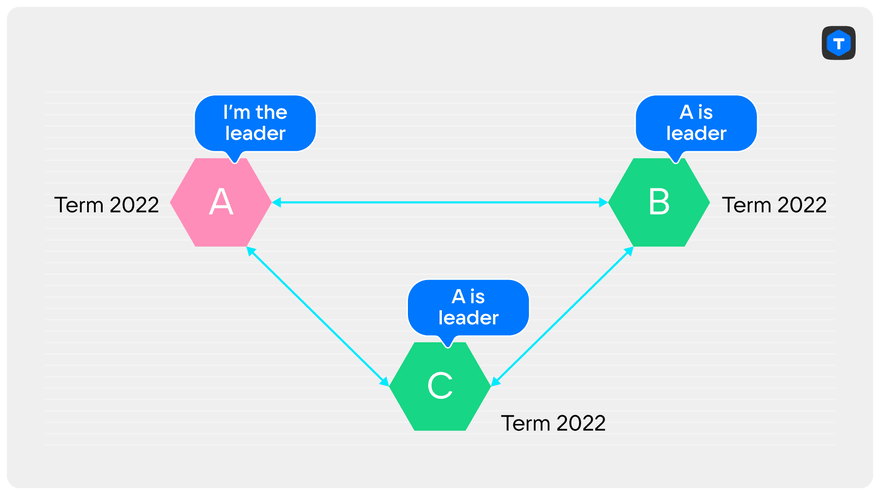
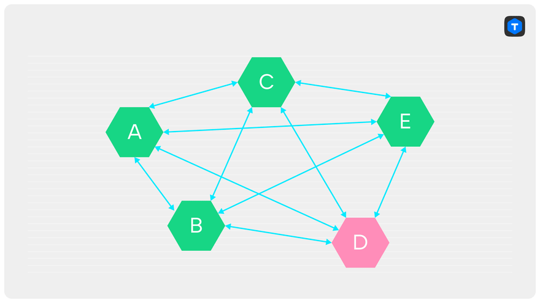

# Raft（不是）全能：如何使其更加健壮

[#raf](https://dev.to/t/raf)[#quorum](https://dev.to/t/quorum)[#algorithms](https://dev.to/t/algorithms)[#programming](https://dev.to/t/programming)

每个人都喜欢Raft。普遍认为，在分布式系统中使用这个算法意味着这个系统将会非常好。具体来说：

1. 只要集群中的大多数节点是活动的并且彼此连接，集群将是可写的（需要暂停进行领导者选举）。
2. 如果领导者正常运行并与大多数节点连接，集群将始终是可写的。
3. 如果领导者宕机，将“快速”选择新的领导者——无论这意味着什么。

事实上，仅仅遵循Raft规范（https://raft.github.io/raft.pdf 或 Diego Ongaro 的博士论文版本）是不足以实现上述所有内容的。即使etcd也曾因此遭受过损失，导致了[2020年的Cloudflare故障](https://blog.cloudflare.com/a-byzantine-failure-in-the-real-world/)。

我叫Sergey Petrenko，我在Tarantool中从事复制工作已经有4年了。今天我想告诉你关于Raft算法的弱点以及如何克服它们。本文是我和Boris Stepanenko在Hydra 2022上的演讲的自由改写。如果你对Raft不熟悉，我建议你阅读[我的这篇文章](https://dzone.com/articles/raft-in-tarantool-how-it-works-and-how-to-use-it)。

让我从远处开始。假设你有一个使用Raft的系统，并希望将其用于生产。我们都听说过，不止一次地听说过，Raft保证每个任期内最多只有一个领导者，并且在集群中丢失不到一半的节点的情况下仍能保持性能。也就是说，如果领导者是活动的，它将能够处理条目，如果没有领导者，将选择一个新的领导者。除了这些保证，似乎我们对系统的长时间运行不需要其他任何东西。这是真的吗？我们即将找出答案。

首先，让我们更仔细地看看只要大多数服务器是活动的并且彼此连接，集群就会保持运行的说法。对这个说法的误解最终导致了Cloudflare的故障。

## 预投票

让我们从一个例子开始。我们将看看在部分连接丢失的情况下，Raft集群的行为。

假设我们的集群由三个节点A、B和C组成。A是领导者。B和C是它的副本；这是第2022个任期。连接A和C的丢失会导致什么结果？在选举超时期间，如果领导者没有发送心跳信号，服务器C会认为领导者丢失，并在2023年开始选举。

服务器B是唯一一个服务器C可以向其发送RequestVote请求的服务器。

一旦服务器B收到一个更大任期的请求，它也会增加自己的任期。然而，它不一定会投票给C，因为如果领导者在A和C之间的连接丢失后写入了一些内容，B可能有更新的数据。

作为对来自领导者（仍然是服务器A）的下一条消息的回应，服务器B将报告任期已经增加，迫使服务器A辞职。集群没有领导者，所以选举开始。在选择领导者之前，集群是不可写的。

如果自连接丢失后没有新的条目，那么一旦服务器B收到服务器C的RequestVote，它将投票给服务器C。

如果发生这种情况，我们就陷入了一个无限循环中：

1. 服务器C看不到领导者。
2. 当选举超时到期时，服务器C开始新的选举。
3. 通过服务器B，任期的增加传达给了服务器A。
4. 服务器B投票给服务器C，所以
5. 服务器A辞职。
6. A和C交换位置，然后从步骤1开始重复，但在新的任期中。

连接到这样一个具有闪烁领导者的集群的客户端很可能根本无法写入任何内容。一旦选出了行动中的领导者，并且客户端尝试执行写操作，领导者就会辞职，甚至不知道应该将写请求转发到哪里，因为它无法直接看到新的领导者。所有这些将会一直发生，直到至少有一个条目可以被创建，或者直到A和C之间的连接恢复。这正是Cloudflare在etcd上发生的情况。外部系统非常合理地认为，如果它无法向etcd集群写入任何内容，这意味着其中大多数节点已经失败，需要采取紧急措施。etcd无法进行写入的短短6分钟导致了持续6个小时以上的事故。

你可能会觉得Raft的一些保证在这里被违反了。实际上并没有。

每时每刻，领导者都与大多数节点（包括自己）连接，并且领导者本身没有失败。然而，我们的期望被打破了。集群无法正常运行。

但问题是，Raft从未承诺在这种情况下能够正常运行。它所做的承诺是“如果大多数节点是功能正常且彼此连接的，将会选择一个领导者”。根本没有提到领导者是永久的。而且选择领导者的保证实际上并没有被违反。在上面的例子中，它大约每个选举超时期间确定一次。结果是，实际上，Raft的保证是不足够的。

但这只是一半的麻烦。

让我们回到第2022个任期，并假设在我们的节点A、B和C的集群中，节点C与其他节点失去了所有通信。服务器A是领导者，它仍然与服务器B连接，并且可以处理写请求。到目前为止，一切都好。

与上面的例子一样，服务器C将在每个选举超时期间开始新的选举。当然，服务器C不可能赢得任何选举。它只是无法获得多数选票。然而，它的任期将无限增长，并且在恢复连接的时刻，只要它看到更大的任期，服务器A就会辞职。集群再次变为只读状态，至少经历了一轮选举，而没有明显的原因。

## Raft的解决方案

这种“破坏性”服务器的问题实际上是Raft的作者Diego Ongaro在他的博士论文中提到的。然而，他提到它们与配置更改有关。

他提出的解决方案是称为预投票（Pre-Vote）的选举的新阶段。其思想是每个服务器在选举之前向所有人发送一个模拟投票请求，称为PreVote。这个请求包含与普通的RequestVote相同的字段，投票者根据与RequestVote相同的规则对其进行回应。唯一的区别是，投票者在收到这个请求时不会增加任期，并且如果它仍然在当前任期中看到领导者，它会否定或者简单地忽略这个请求。

只有在收到大多数选民准备好为其投票的确认后，候选人才会提升任期并开始真正的选举。

让我们检查一下PreVote是否真的可以拯救Cloudflare免受这次事故的影响。考虑相同的情况，C与领导者失去了连接，但与其他副本没有失去连接。尽管C可以向B发送PreVote请求，但B会否定它，因为它仍然看到领导者。C将无法获得多数选票——2个PreVote的回应。

在完全失去连接并随后恢复连接的情况下，PreVote也会有所帮助。确实，服务器C将无法获得任何PreVote请求的回应，因此不会开始选举。

这个解决方案对我们来说唯一的缺点是违反了向后兼容性。Raft在Tarantool中已经运行了一段时间，协议中没有PreVote请求。当然可以添加，但旧的服务器不知道如何处理新的请求。我们必须在发送方引入新的逻辑：如果服务器是旧的，我们不发送PreVote请求，并默认假设它肯定会回应。我们不喜欢这种冗余，而且希望摆脱支持旧版本的额外代码。更好的解决方案是扩展现有请求中的一个。旧的服务器只会忽略现有请求中的新字段，因此不需要额外的逻辑。所以这就是我们选择的方式。

## 我们的解决方案

“在Tarantool中，服务器知道在不必要的情况下不会开始选举”，我们这样想，并且我们按照我们自己的方式进行了Pre-Vote。我们让所有的副本告诉其他副本它们是否看到了当前的领导者。收集到关于谁看到领导者和谁没有看到领导者的信息后，可以决定是否开始选举。如果有任何人看到领导者，或者如果与大多数节点没有连接，就不会启动选举。

我们解决方案的优势在于它的向后兼容性。我们不需要引入新的请求并以特殊的方式将其发送到旧的服务器，如果集群中有不同版本的Tarantool服务器。

缺点是我们不比较领导者的日志和选民的日志，这意味着我们即使选民的日志包含更新的数据，也会开始选举。这不一定是件坏事：只要有人看到领导者，就不会进行选举。当每个人都不再看到它时，选举将无论如何开始。选举是否在一个或多个轮次中结束并不重要，这要归功于我们的另一个修改，Split-Vote检测。现在，让我们谈谈它。

## Split-Vote检测

这次我没有Cloudflare或其他著名公司的可怕案例，但希望它仍然有趣。

你可能知道，并不是每一轮选举都会产生一个领导者。例如，如果集群中的几个节点同时注意到领导者丢失，它们将在彼此收到RequestVote请求之前独立地开始选举。剩下的副本的选票可能会分散在几个候选人之间，以至于没有一个候选人能赢得多数选票。我们将这种情况称为分裂投票。

Raft通过随机化选举超时时间来处理这个问题。在每个服务器和每一轮中，都会选择一个与配置值略有不同的新随机值。这增加了只有一个候选人有时间开始下一轮选举的机会，而其他候选人在他们自己的选举超时到期之前会收到来自它的RequestVote请求。如果Raft没有实现这个功能，选举可能永远不会结束：所有服务器都会同步重新启动，为自己投票。但仍然有优化的空间：每一轮额外的选举时间都是只读集群停机的选举超时时间。

## 我们的解决方案

实际上，以平局结束的轮次是浪费时间的。如果已经选出了一个领导者，它可能在轮次开始时就已经产生了（大约在最远的服务器的数据包交换时间内）。根据Raft的规定，选举超时时间要比这个长得多。

此外，与规范的Raft实现不同，在Tarantool中，服务器不仅将投票信息发送给它投票的候选人，还会发送给所有集群成员。这意味着每个服务器都可以跟踪每个候选人收到的选票数。当看到没有候选人能在当前轮次中获胜时，服务器会加快开始新轮次的速度。从检测到平局到开始新轮次平均需要0.05 * 选举超时时间。这是因为我们在选举超时时间/10的范围内选择一个随机延迟来重新启动选举。我们之所以这样做，完全是出于与Raft相同的目的：避免新的平局。因此，在最好的情况下，我们在每个平局轮次上节省了大约0.9 * 选举超时时间。这种改进是非常明显的：在原始的Raft中，在两轮选举中选出领导者意味着花费大约选举超时时间 + 选举超时时间的一部分时间。然而，使用我们的实现，两轮这样的选举只需要不到一个选举超时时间的一部分时间。这比原始的Raft意识到发生平局所需的时间更快。

在最坏的情况下，当连续发生两次平局时，我们处理得更快。对我们来说，每一轮平局几乎没有成本。此外，我们不会以任何方式增加第二次平局的概率：在这种情况下，重新启动选举的随机延迟在与通常情况下相同的范围内生成。

## CheckQuorum

Raft确保在一个任期内不会有两个领导者。然而，并没有说两个领导者在同一时间点存在的可能性：在旧任期和新任期中。我们当然希望避免这种情况的发生。原因是连接到旧领导者的客户端可能不知道有新领导者存在。直到旧领导者实际辞职之前，他们根本没有理由寻找新领导者。旧领导者仍然是可写的，同步事务在没有从大多数副本获得确认的情况下将被回滚。

对于我们来说，同一时间点存在两个领导者可能是关键的，因为Tarantool不仅支持同步复制，还支持异步复制。每个领导者都是可写的，如果你在旧领导者上写入异步事务，客户端可能会忽略新领导者的存在。这将导致一些客户端联系新领导者，而另一些客户端联系旧领导者。我们将会遇到脑裂问题。为了避免这种情况，旧领导者必须在有可能被取代的情况下辞职并进入只读状态。

只有当旧领导者与集群中大多数服务器失去连接时，才有可能存在两个领导者的情况。实际上，要赢得选举，必须获得多数选票，旧领导者之所以不知道选举的情况，唯一的可能就是它与大多数节点没有连接。如果它与至少一个投票给新领导者的服务器连接，它将立即辞职。而且不可能出现旧领导者与大多数节点连接，但没有人投票，同时新领导者与投票多数连接的情况。

因此，我们希望确保领导者在失去与大多数集群的连接时立即辞职。如果当前领导者的连接丢失，很可能大多数已经选择了另一个领导者。

还有另一个原因需要CheckQuorum：如果只有PreVote，集群可能会被锁定：当前领导者无法写入任何内容，副本也无法开始选举。让我们看一个例子：假设我们有一个由五个服务器组成的集群，其中D是领导者。接下来发生了一系列非同寻常的事件：首先，服务器E崩溃，然后由于某种原因A和D之间的连接断开，最后，由于另一种原因，C和D之间的连接断开。

结果，尽管服务器D仍然是领导者，但它无法提交同步事务，因为它无法获得三个确认。服务器B不会开始选举，因为它仍然看到领导者D。服务器A和C也不会开始选举，因为服务器B告诉它们领导者是活动的。

CheckQuorum通过使失去与大多数集群连接的领导者辞职并允许其中一个副本接替它的位置来帮助解决这个问题。

现在需要决定领导者应该在什么时候辞职。对于被阻塞的集群示例，这并不重要。这里的主要问题是，领导者最终会辞职，使其副本能够开始选举。

如果只涉及同步复制，一切都会很好。辞职的速度也不重要。旧领导者无法确认连接中断后的任何同步事务。

如果涉及异步事务，你必须采取一些措施来确保一致性。

**最低要求**是旧领导者必须在副本开始选举之前**严格**辞职。这是为了确保集群没有同时存在两个可写节点。我们将这种模式称为严格CheckQuorum。

但这还不够。我们无法保证在连接失败后不会写入任何异步事务。无论如何，要检测到连接失败，都需要一些时间，无论多短。这意味着旧领导者可能会写入一个新领导者没有的事务。当连接最终恢复时，事务将到达其他节点，并且新领导者写入的所有内容的一致性可能会受到损害。因此，我们的最终目标。

**最终目标：**在恢复连接后，新领导者及其所有副本不得应用由前任领导者记录的事务。我们将在下一章中更详细地介绍这个问题，但现在让我们讨论如何实现所需的最低要求。

领导者和副本都通过心跳监控连接的状态。如果在4 * 复制超时时间内没有收到来自服务器的心跳信号，就认为连接已断开。副本的心跳是对主服务器的心跳的回应，只有在收到主服务器的心跳后才会发送。

正如你所看到的，最后一次心跳交换后，领导者重新启动连接计时器的时间比副本晚。在最坏的情况下，副本的最后一个心跳将恰好在超时到期时到达领导者。领导者不知道副本发送心跳的时间点，它的超时可能已经到期。

如果副本还能够进行快速选举，旧领导者将辞职得太晚。

因此，为了确保领导者严格在大多数节点开始新选举之前辞职，领导者的超时时间需要是副本的一半。这就是我们要做的。

## Split-Brain检测

Tarantool允许你配置一个法定人数。这在很多情况下都很方便；例如，你可以紧急解锁大多数节点失败的集群。但这也是危险的：如果法定人数低于N / 2 + 1，可能会有两个未连接的领导者。无论是在同一个任期还是在不同的任期中。这两个领导者都可以独立地确认同步事务并写入异步事务。如果在两个领导者在集群中工作一段时间后恢复连接，其中一个的更改将覆盖另一个的更改。为了防止这种情况发生，你需要检测到来自竞争领导者的事务，并在不应用它们的情况下终止与发送它们的节点的连接。

## PROMOTE条目

新领导者出现的标志是PROMOTE条目。它包含选举产生领导者的任期、领导者的ID、前任领导者的ID和前任领导者收到的最后一个LSN。这些信息足以构建从第一个任期到最后一个任期的线性领导历史。当集群正常运行时，每个传入的PROMOTE都与节点已知的信息进行匹配。任期应该是迄今为止所有PROMOTE中最大的，前任领导者的ID必须与前一个PROMOTE中的ID匹配，前任领导者的LSN必须与前任领导者的最后一个已确认事务的LSN匹配。

如果上述条件中的任何一个不满足，那么就发生了脑裂。

我们还需要检测旧领导者在新领导者出现在集群中之后继续确认事务的情况。实际上，来自未发送最后一个PROMOTE的节点的任何事务都是脑裂的指标。

最后一个例子也解决了我们严格CheckQuorum的问题：现在来自旧领导者的任何事务（包括同步和异步）都会导致与其的连接断开，并且不会被应用，从而保持了新领导者及其副本的数据一致性。因此，旧领导者无法影响新领导者及其副本的状态。

## 吸取的教训

Raft算法的规范版本在部分连接丢失的情况下无法提供完整的集群可操作性。为了解决这个问题，使用了以下两个改进：PreVote和CheckQuorum。

我们对规范版本的改进允许更快地进行选举，并检测到平局，尽管同时需要额外的修改来确保一致性：严格的CheckQuorum和Split-Brain检测。

你可以在官方网站上[下载Tarantool](http://www.tarantool.io/en/download/os-installation/docker-hub/?utm_source=dev&utm_medium=referral&utm_campaign=2022)，并在我们的Telegram聊天中[获取帮助](http://t.me/tarantool?utm_source=dev&utm_medium=referral&utm_campaign=2022)。