# Raft (not)almighty: how to make it more robust

[#raf](https://dev.to/t/raf)[#quorum](https://dev.to/t/quorum)[#algorithms](https://dev.to/t/algorithms)[#programming](https://dev.to/t/programming)

Everybody loves Raft. There is a common opinion that the presence of this algorithm in a distributed system implies that this system will be just fine. Namely:

1. As long as most nodes in the cluster are live and connected to each other, the cluster will be writable (with pauses for leader election).
2. If the leader is functional and connected to the majority, the cluster will be writable at all times.
3. If the leader goes down, a new leader will be chosen “quickly” — whatever that means.

In fact, simply following the Raft specification (https://raft.github.io/raft.pdf or its version from the Diego Ongaro's PhD thesis) is not enough to achieve everything listed above. Even etcd got burned on this once, leading to the [Cloudflare outage in 2020](https://blog.cloudflare.com/a-byzantine-failure-in-the-real-world/).

My name is Sergey Petrenko, and I have been working on replication in Tarantool for 4 years now. Today I want to tell you about the weak spots of the Raft algorithm and ways to overcome them. This article is a free paraphrase of my and Boris Stepanenko's [speech at Hydra 2022](https://hydraconf.com/talks/f7082c470b8f4ddd894a940f892f40fb/). If you are not familiar with Raft, I suggest you read [my article on it](https://dzone.com/articles/raft-in-tarantool-how-it-works-and-how-to-use-it).

Let me start a little bit from afar. Suppose you have a system with Raft and want to use it in production. We've all heard — and more than once — that Raft guarantees no more than one leader in each term, and it can survive the loss of just under half of the nodes in the cluster without losing performance. That is, if the leader is live, it will be able to process entries, and if there is no leader, a new one will be chosen. It would seem that apart from these guarantees, we don't need anything else for a prolonged operation of the system. Is this really the case? We're about to find out.

First, let's take a closer look at the claim that the cluster will remain operational as long as most of the servers are live and connected to each other. The misunderstanding of this claim is what eventually resulted in the Cloudflare outage.

## Pre-Vote

Let's begin with an example. We'll look at how a Raft cluster will behave in the case of partial loss of connectivity.

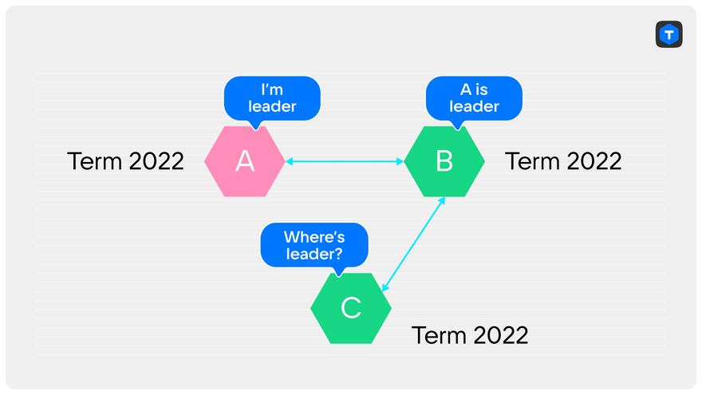

Suppose our cluster consists of three nodes: A, B, and C. A is the leader. B and C are its replicas; it's the 2022nd term. What does the loss of the connection between A and C result in? Without a single heartbeat from the leader for election_timeout, server C decides that the leader is missing and starts the election in term 2023.

Server B is the only one to whom server C can send a RequestVote.

Once server B receives a request with a larger term, it will increase its own term as well. However, it won't necessarily vote for C, as B might have more recent data if the leader has written something since the connection between A and C was lost.

In response to the next message from the leader (which is still server A), server B will report that the term has increased, forcing server A to resign. The cluster is left without a leader, so the election starts. Until the leader is chosen, the cluster is not writable.

If there happen to be no new entries since the connection was lost, then server B will vote for server C as soon as it receives its RequestVote.

[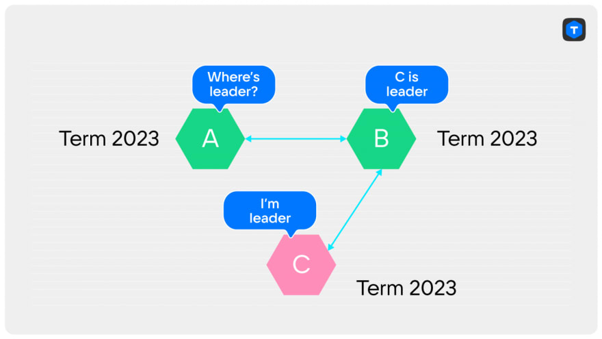](https://res.cloudinary.com/practicaldev/image/fetch/s--ech3-gSA--/c_limit%2Cf_auto%2Cfl_progressive%2Cq_auto%2Cw_880/https://dev-to-uploads.s3.amazonaws.com/uploads/articles/kbg4lpz8u1qzrftjygy9.png)

And if that happens, we're caught in an infinite loop:

1. Server C can't see the leader.
2. When election_timeout expires, server C starts the new election.
3. The increase of the term reaches server A through server B.
4. Server B votes for server C, so
5. server A resigns.
6. A and C change places, and the whole thing repeats from step 1, but in the new term.

A client connected to such a cluster with a blinking leader will most likely not be able to write anything at all. As soon as the acting leader is elected and the client tries to perform a write operation, the leader already resigns without even knowing where it should forward the write request, as it does not see the new leader directly. All of this will keep on happening until, by some miracle, at least one entry can be made, or until the connection between A and C is restored. This is exactly what happened in Cloudflare with etcd. And the external system quite reasonably decided that if it cannot write anything to the etcd cluster, it means that most of the nodes in it have failed and emergency measures are to be applied. Just 6 minutes of etcd being unavailable for writing led to an accident lasting more than 6 hours.

You might feel like some of Raft's warranties had been violated here. Actually, no.

At every moment the leader is connected to the majority (including itself), and the leader itself does not fail. And yet our expectations are shattered. The cluster is not operational.

But the thing is, Raft never promised operability in such a situation. The promise it made was that “a leader will be chosen if most of the nodes are functional and connected to each other”. There's no mention of the leader being permanent at all. And the guarantee that a leader will be chosen is not actually breached. In the example above, it is determined approximately once per election_timeout. It turns out that, in practice, Raft's guarantees are not sufficient.

But that's only half the trouble.

Let's go back to term 2022, and assume that in our cluster of nodes A, B, and C, node C has lost all communication with the others. Server A is the leader, it's still connected to server B and can process write requests. So far, so good.

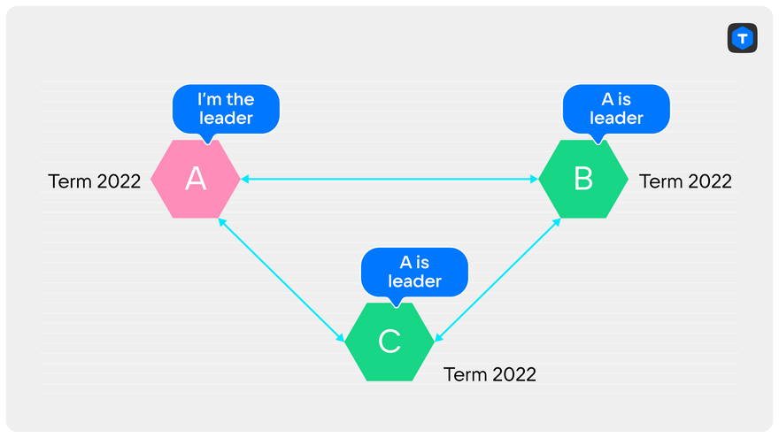

Server C, as in the example above, will start a new election every election_timeout. Of course, server С can't win any of them. It just won't get a majority of votes. However, its term will grow infinitely, and at the moment of restoring connectivity, server A will again resign as soon as it sees the larger term. The cluster went read-only again for at least one round of elections for no apparent reason.

## Raft's solution

The problem of such “disruptive” servers is actually brought up by the author of Raft, Diego Ongaro, in his dissertation. He does, however, mention them in relation to configuration changes.

The solution proposed by him is a new stage of the election called Pre-Vote. The idea is that each server sends out a mock vote request to everyone prior to an election, which is called PreVote. This request contains the same fields a normal RequestVote does, and the voter responds to it using the same rules as for RequestVote. The only difference is that the voter does not raise the term upon receiving this request, and also answers negatively or simply ignores the request if it still sees the leader in the current term.

A candidate raises the term and starts a real election only after receiving confirmation that the majority of voters are ready to vote for it.

Let's check if PreVote really would have saved Cloudflare from that incident. Consider the same situation, where C lost connection with the leader, but not with the other replica. Although C can send to B a PreVote request, B will respond to it negatively, since it still sees the leader. C will not be able to get a majority — 2 answers to its PreVote.

In the case of complete loss and subsequent restoration of connectivity, PreVote will also help. Indeed, server C will not be able to get any response to the PreVote request, and therefore will not start the election.

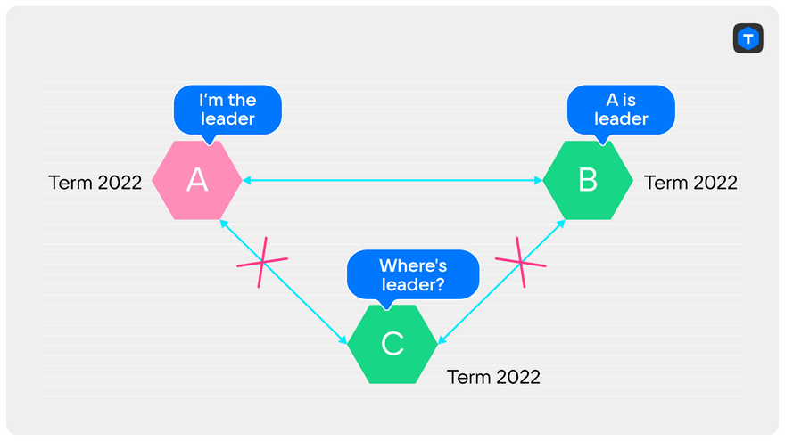

The only disadvantage of this solution for us is the violation of backward compatibility. Raft has been operating in Tarantool for some time now, and there is no PreVote request in the protocol. It can, of course, be added, but the old servers wouldn't know how to handle new requests. We would have to introduce new logic on the sender side: if the server is old, we don't send it a PreVote request and by default assume it responded positively. We don't like such redundancy, and aim to get rid of the existing extra code for supporting old versions. A solution that extends one of the existing requests would suit us better. Older servers simply ignore new fields in an existing request, which means no additional logic is needed. So that's the way we chose.

## Our solution

“In Tarantool, the server knows enough not to start an election when it's not necessary”, we thought, and we did Pre-Vote our way. We made all the replicas tell the others whether they see the current leader or not. Having gathered information about who sees a leader and who does not, you can decide whether to start an election. If anyone sees a leader, or if there is no connection to the majority, the election wouldn't be initiated.

The strength of our solution is in its backward compatibility. We didn't need to introduce a new request and handle sending it to the old servers in a special way if there are servers with different versions of Tarantool in the cluster.

The downside is that we do not compare the leader's logs and the voters' logs, which means we start the election even if the voters' logs contain more recent data. That's not necessarily a bad thing: as long as someone sees a leader, there won't be an election. And when everyone stops seeing it, the election will start anyway. Whether it ends in one or several rounds is not so important, thanks to another one of our modifications, Split-Vote detection. Now, let's talk about it.

## Split-Vote detection

I don't have a Cloudflare's or other famous company's scary case for you this time, but hopefully it will be interesting all the same.

As you probably know, not every election round ends with a leader emerging. For example, if several nodes in a cluster at the same time notice the leader missing, they will start the election independently, before they receive RequestVote requests from each other. The votes of the remaining replicas might get divided among several candidates in such a way that no single candidate will win a majority. We'll call this situation a split-vote.

Raft handles this by randomizing the election_timeout. On each server and in each round, a new random value is chosen, slightly different from the configured one. This increases the chances that only one candidate will have time to start the next election, and the others will receive a RequestVote from it before their own election_timeout expires. If Raft hadn't implemented this, the election might never have ended: all servers would have restarted in sync, casting their vote for themselves. But there's still room for optimization: every extra round of elections is an election_timeout of read-only cluster downtime.

## Our solution

In fact, rounds that ended up with a draw are a waste of time. If a leader had been elected, it would probably have happened at the beginning of the round (approximately within the packet exchange time for the most distant servers). The election_timeout is much longer than this, according to Raft.

In addition, unlike the canonical Raft implementation, in Tarantool the server sends information about the vote not only to the candidate for whom it voted, but to all cluster members. This means that each of the servers can keep track of how many votes each candidate received. Upon seeing that none of the candidates can win in the current round anymore, the server speeds up the start of a new round. An average of 0.05 * election_timeout elapses from the moment a draw is detected to the start of a new round. It happens because we choose a random delay within election_timeout / 10 to restart the election. We did it for exactly the same purpose Raft did: to avoid a new draw. Thus, at best, we save approximately 0.9 * election_timeout on each round with a draw. This improvement is quite noticeable: electing the leader within two rounds in the original Raft means spending about election_timeout + some fraction of election_timeout time for that. With our implementation, however, two such rounds would take just a fraction of an election_timeout. Which is faster than it takes for the original Raft to realize that a draw has occurred.

In the worst case scenario, when a draw happens 2 or more times in a row, we process this even more rapidly. Every draw round is practically costless for us. Moreover, we do not increase the probability of a second draw in any way: the random delay for restarting the election in this case is generated within the same limits as in the usual situation.

## CheckQuorum

Raft ensures that there cannot be two leaders in one term. However, nothing is said about the possibility of two leaders existing at one point in time: in the old term and in the new one. We would sure like to avoid that kind of situation. The reason is that clients connected to the old leader may not be aware that there is a new one. They would simply have no reason to look for the new leader until the old one actually resigned. The old leader will still be writable, and synchronous transactions will be rolled back after not gaining ACKs from most replicas.

[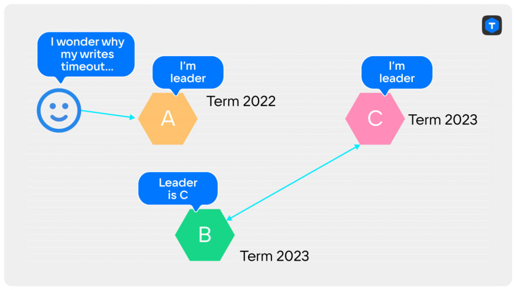](https://res.cloudinary.com/practicaldev/image/fetch/s--VTlzgeuf--/c_limit%2Cf_auto%2Cfl_progressive%2Cq_auto%2Cw_880/https://dev-to-uploads.s3.amazonaws.com/uploads/articles/6y7ja3svp5mt4hr5yx9b.png)

For us, the presence of two leaders at one point in time can be critical, since Tarantool supports not only synchronous, but also asynchronous replication. Each leader is writable, and if you write asynchronous transactions on the old leader, the client may miss that the leader has changed at all. This will result in some clients reaching out to the new leader and some to the old one. And we're going to get a split brain. To avoid this, the old leader must resign and go read-only as soon as there is a chance of it being displaced.

The situation with two leaders existing is possible only when the old one has lost communication with most of the servers in the cluster. Indeed, since you have to get a majority to win an election, the only way the old leader will not know about the election is if it has no connection to the majority. If it was connected to at least one server that voted for a new leader, it would immediately resign. And there can be no situation where the old leader is connected to a majority among which no one voted, and at the same time the new leader is connected to a voted majority.

So, we want to make sure that the leader resigns as soon as it loses connection to the majority of the cluster. If the current leader's connectivity is lost, it's quite likely that the majority has already chosen a different one.

There is another reason why CheckQuorum is necessary: without it, the PreVote alone can cause the cluster to be locked: the current leader cannot write anything, and none of the replicas can start an election. Let's look at an example: suppose we had a cluster of five servers where D was the leader. What happened next was an extraordinary chain of events: first, server E crashed, then for some reason the connection between A and D broke, and finally, for some other reason, the connection between C and D broke.

As a result, although server D remains the leader, it can not commit synchronous transactions, as it can not gain three confirmations. Server B does not start the election since it still sees the leader — D. And servers A and C won't start the election because server B has told them that the leader is live.

CheckQuorum helps to save this situation by making a leader which loses connection with the majority resign and allow one of the replicas to take its place.

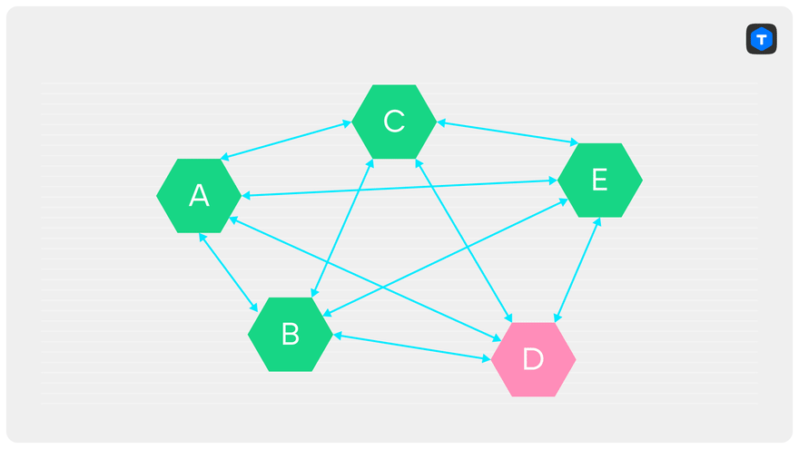

It remains to be decided at what point the leader should resign. For the blocked cluster example, it doesn't really matter. The main point here is that the leader will resign eventually, allowing its replicas to start the election.

If only synchronized replication is involved, everything will be fine. The speed of resigning is not critical, either. The old leader will not be able to confirm any of the synchronous transactions that came after the connection broke anyway.

If asynchronous transactions are involved, you have to do several things to ensure consistency.

**The bare minimum** is that the old leader must resign **strictly **before the replicas can elect a new leader. This is necessary to ensure that the cluster does not have two writable nodes at the same time. We will call this mode the strict CheckQuorum.

But that is not enough. We cannot guarantee that no asynchronous transaction will be written after a connection failure. In any case, it will take some time, however short, before a loss of connection is detected. This means that the old leader might write a transaction that won't be on the new one. When the connection is finally restored, the transaction will reach the other nodes, and the consistency of everything the new leader wrote may be compromised. Hence, our ultimate goal.

**The ultimate goal:** after restoring connectivity, the new leader and all its replicas must not apply the transactions logged by the previous leader. We will cover this in more detail in the next chapter, but for now let's talk about how to achieve the necessary minimum.

Both the leader and the replicas monitor the state of the connection via heartbeats. If no heartbeats were received from the server within 4 * replication_timeout, the connection is considered broken. A replica's heartbeat is a response to the master's heartbeat, and is sent only after receiving the heartbeat from the master.

[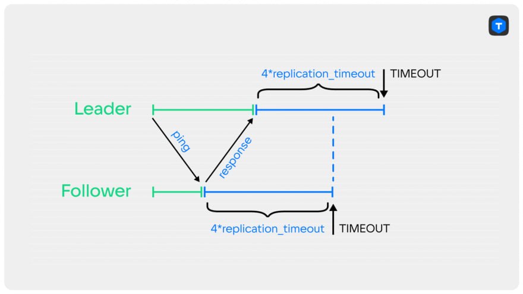](https://res.cloudinary.com/practicaldev/image/fetch/s--wStRaFkz--/c_limit%2Cf_auto%2Cfl_progressive%2Cq_auto%2Cw_880/https://dev-to-uploads.s3.amazonaws.com/uploads/articles/k23kva9482sf1c9tyl69.png)

As you can see, after the last heartbeat exchange, the leader restarts the connectivity timer later than the replica does. In the worst case, the last heartbeat from the replica will reach the leader exactly as the timeout expires. The leader does not know at what point the replica sent its heartbeat, and its timeout might have already elapsed by then.

If the replica in addition manages to hold a quick election, the old leader would resign too late.

[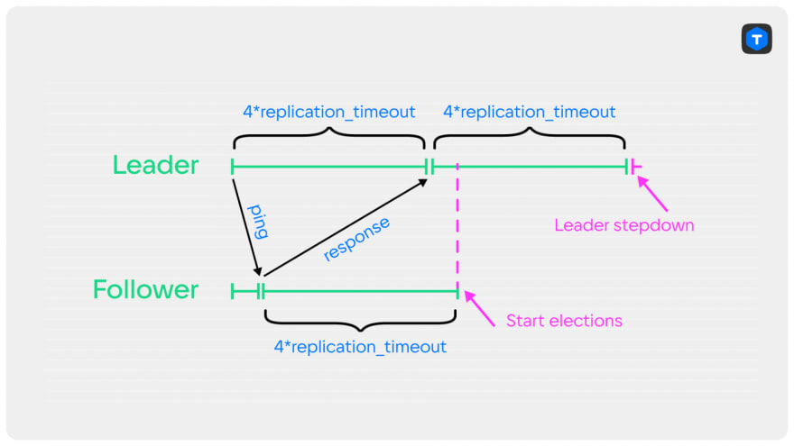](https://res.cloudinary.com/practicaldev/image/fetch/s--7Kep6Oxy--/c_limit%2Cf_auto%2Cfl_progressive%2Cq_auto%2Cw_880/https://dev-to-uploads.s3.amazonaws.com/uploads/articles/7jsvtyzpf4tbghi14xbl.png)

So, in the very worst case, the leader will notice the connection failure twice as late as the replica. So, in order to guarantee the resignation of a leader strictly before the majority of nodes starts new election, the timeout on the leader needs to be half as much as the one on the replicas. That's what we are going to do.

[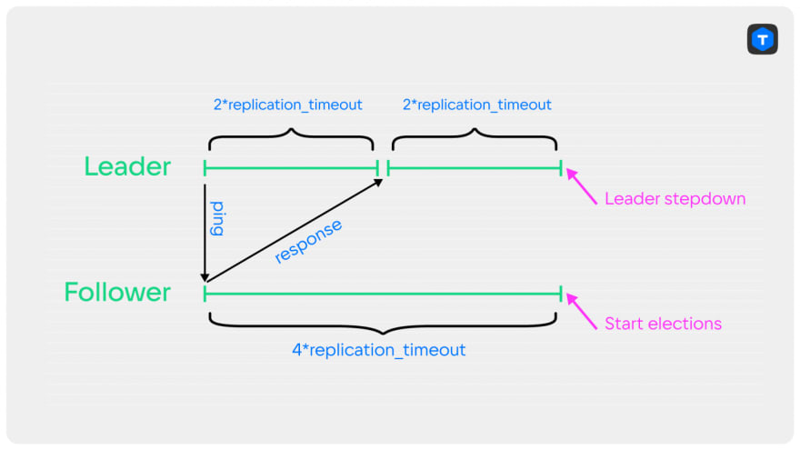](https://res.cloudinary.com/practicaldev/image/fetch/s--c_QpoCoO--/c_limit%2Cf_auto%2Cfl_progressive%2Cq_auto%2Cw_880/https://dev-to-uploads.s3.amazonaws.com/uploads/articles/93iheqbsxdc6as4qocrh.png)

## Split-Brain detection

Tarantool allows you to configure a quorum. This is handy in a lot of cases; for example, you can urgently unblock a cluster in which most of the nodes have failed. But it is also dangerous: with a quorum lower than N / 2 + 1, there may be two unconnected leaders. Either in the same term, or in different ones. Both leaders can independently confirm synchronous transactions and write asynchronous ones. If you restore connectivity after two leaders have been working in the cluster for some time, the changes of one will overwrite the changes of the other. To prevent this, you need to detect transactions from a competing leader in the replication stream, and, without applying them, terminate the connection to the node that sent them.

## PROMOTE entry

The marker of a new leader emergence is the PROMOTE entry. It contains the term in which the leader was elected, the ID of that leader, the ID of the previous leader, and the last LSN the previous leader received. This information is sufficient to construct a linear history of leadership from the very first term to the end. When the cluster is operating correctly, each incoming PROMOTE is matched with information known to the node. The term should be the largest of all PROMOTEs so far, the ID of the previous leader must match the ID in the previous PROMOTE, and the LSN of the previous leader — with the LSN of the last confirmed transaction of the previous leader.

[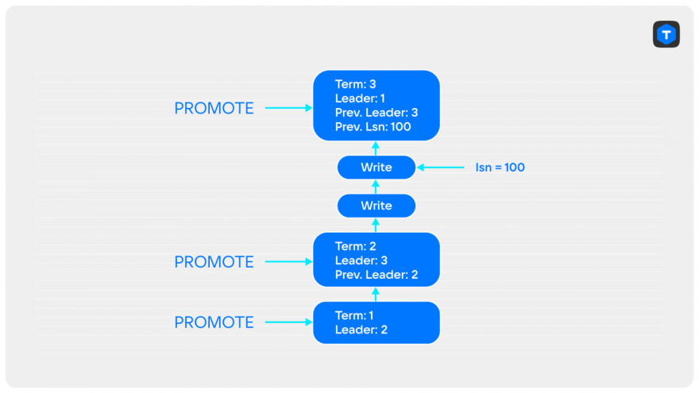](https://res.cloudinary.com/practicaldev/image/fetch/s--8SLtrNN2--/c_limit%2Cf_auto%2Cfl_progressive%2Cq_auto%2Cw_880/https://dev-to-uploads.s3.amazonaws.com/uploads/articles/wybchhsgzubkp0xi44m3.png)

If at least one of the conditions is not met, then a split-brain has occurred.

[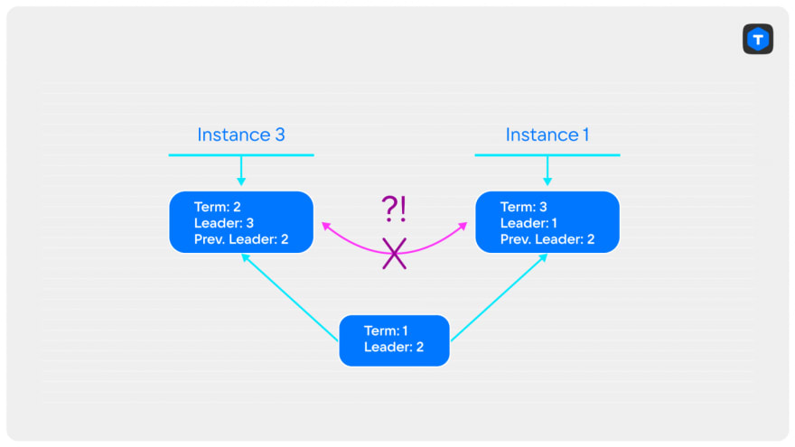](https://res.cloudinary.com/practicaldev/image/fetch/s--2eOYTlKl--/c_limit%2Cf_auto%2Cfl_progressive%2Cq_auto%2Cw_880/https://dev-to-uploads.s3.amazonaws.com/uploads/articles/a2en0arbfdsdluwgvug8.png)

We also need to detect cases where the old leader kept confirming transactions after the new leader appeared in the cluster. In fact, any transaction coming from a node that did not send the last PROMOTE is an indicator of a split-brain.

[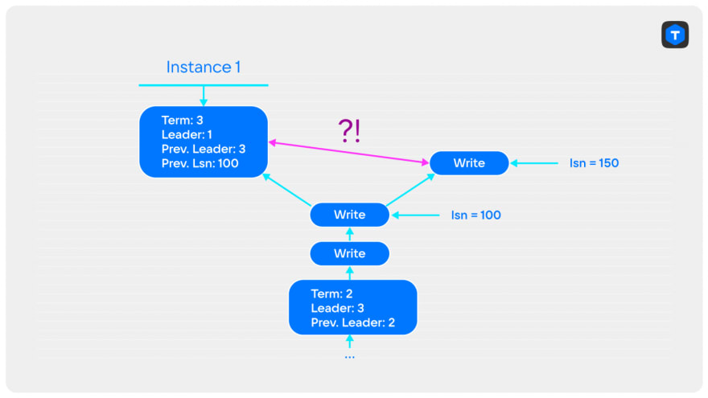](https://res.cloudinary.com/practicaldev/image/fetch/s--A4hKPDLI--/c_limit%2Cf_auto%2Cfl_progressive%2Cq_auto%2Cw_880/https://dev-to-uploads.s3.amazonaws.com/uploads/articles/2d1ban7p6zx0cgv60qi4.png)

This last example also solves our problem with strict CheckQuorum: now any transaction (both synchronous and asynchronous) coming from the old leader results in breaking the connection with it and would not be applied, thereby preserving data consistency on the new leader and its replicas. And so the old leader cannot influence the state of the new leader and its replicas.

## Lessons learned

The canonical version of the Raft algorithm does not provide full cluster operability in case of partial loss of connectivity. To deal with this, the following two improvements are used: PreVote and CheckQuorum.

Our variation of the canonical implementation allowed faster elections with draw detection, although at the same it required additional modifications to ensure consistency: strict CheckQuorum and Split-Brain detection.

You can [download Tarantool](http://www.tarantool.io/en/download/os-installation/docker-hub/?utm_source=dev&utm_medium=referral&utm_campaign=2022) on the official website and [get help in our Telegram chat](http://t.me/tarantool?utm_source=dev&utm_medium=referral&utm_campaign=2022).
